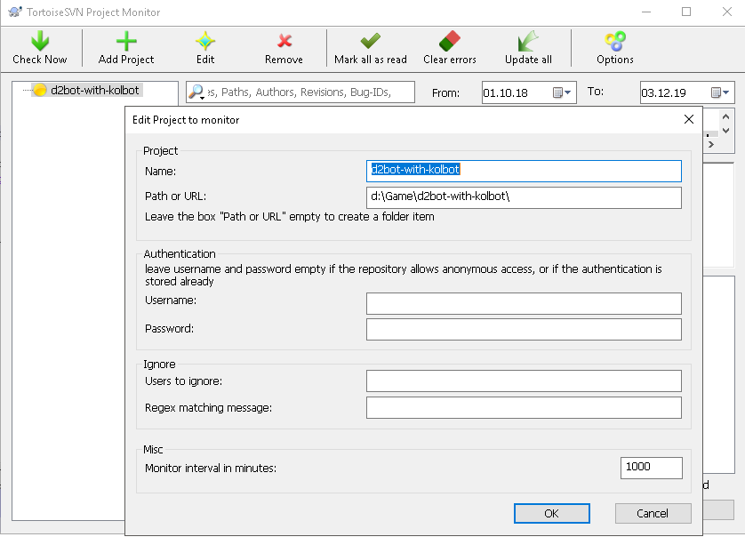
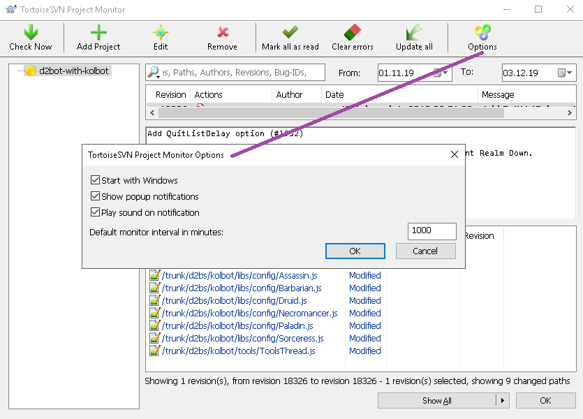
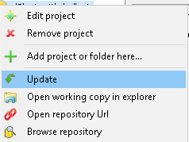

# Autoupdate

## tortoiseSVN project monitor

[TortoiseSVN](https://tortoisesvn.net/), version 1.9 and later, has a project monitor included, which has similar features as the [CommitMonitor](#commit-monitor). 
You should start ...\TortoiseSVN\bin\TortoiseProc.exe. By default the interval for monitoring is set to 30 minutes, and can have a maximum value of 1000 minutes.

* you should also check the options:

* you could update the monitorized repositories using this utility, with a single R-click:

## commit monitor

An additional tool which will help you to be informed about the new changes on repositories is [CommitMonitor](https://tools.stefankueng.com/CommitMonitor.html)

If you want to be notified thrrough [Snarl](http://snarl.fullphat.net/content/download/) you should install/download the zip.
Check the [guide](https://tortoisesvn.net/docs/release/TortoiseSVN_en/tsvn-projectmonitor.html).
