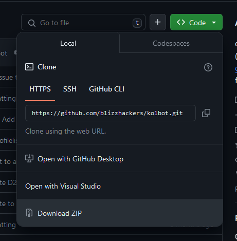
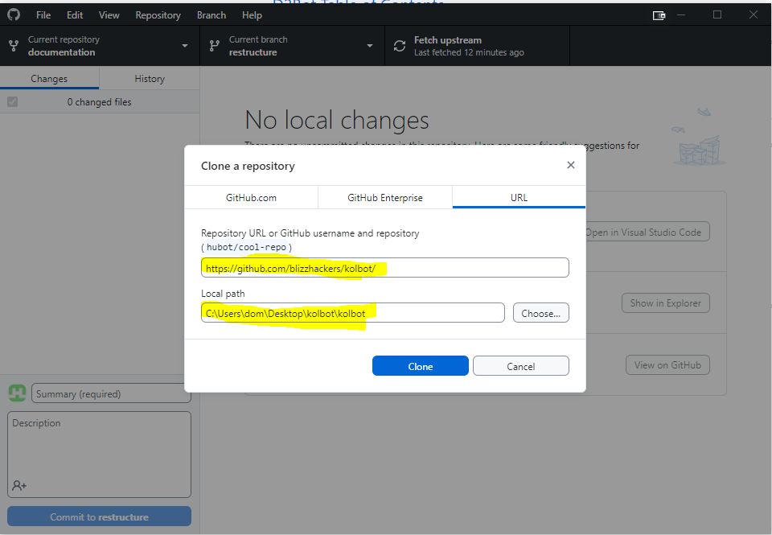
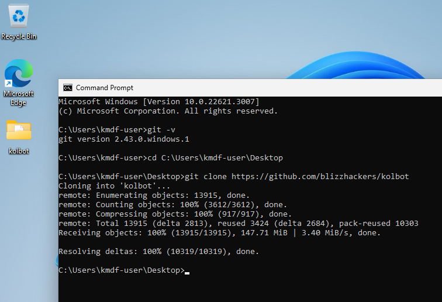
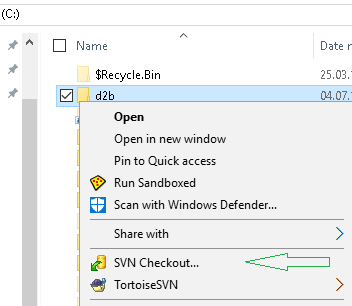
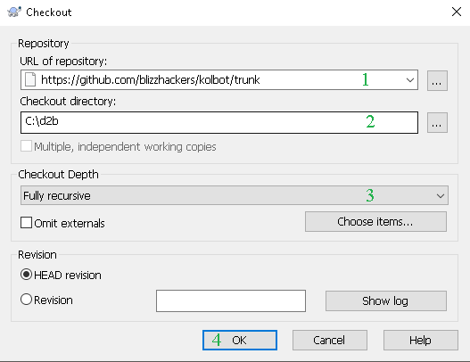
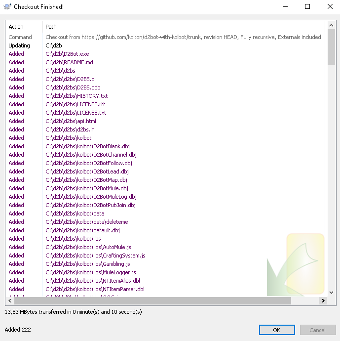
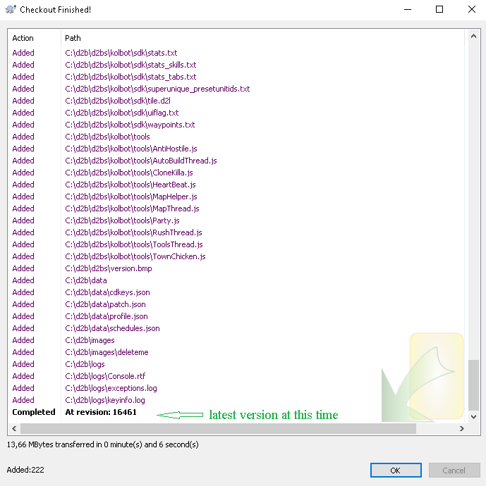
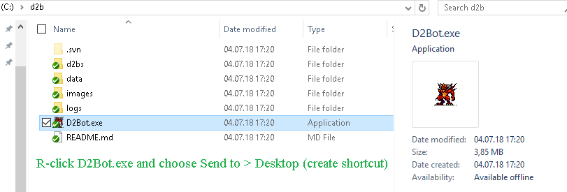
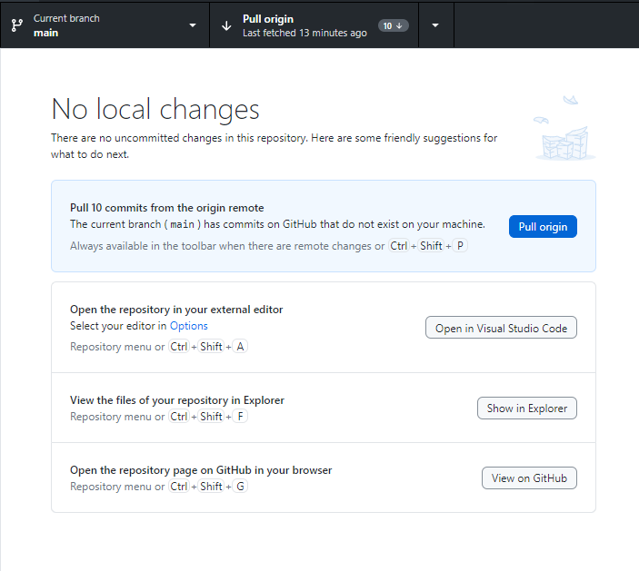
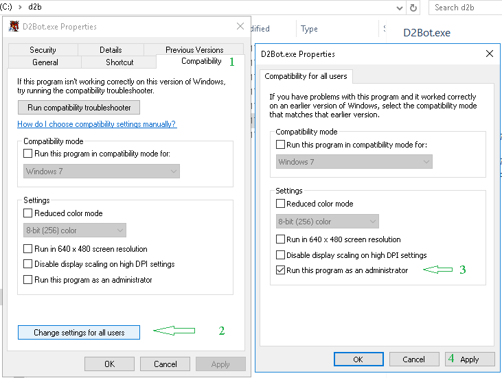

# Download

## Prerequisites

The following must to be installed to run D2Bot#

* [Microsoft Visual C++ 2010 Redistributable Package (x86)](https://download.microsoft.com/download/1/6/5/165255E7-1014-4D0A-B094-B6A430A6BFFC/vcredist_x86.exe)
* [Microsoft .NET Framework 4.0 (or higher)](https://dotnet.microsoft.com/download/dotnet-framework)

## As ZIP

* Navigate to https://github.com/blizzhackers/kolbot
* Click the green button that says `<> Code`
* Click `Download ZIP` at the bottom
* Extract the contents where you want

:::info
To update simply repeat the steps to download as zip and extract in the same location as before and overwrite all files when asked (close D2Bot# before doing this!).
:::

## Using Github Desktop

* Install [Github Desktop](https://desktop.github.com/)
* Open GitHub desktop and select "file" then "clone repository" or click CTRL + SHIFT + O
* Select URL and enter the following: "https://github.com/blizzhackers/kolbot/"
* Select a local path you want to save to.  I selected "C:\Users\dom\Desktop\kolbot\kolbot"
* Click Clone and you have successfully downloaded kolbot.

## Using Git CLI (Advanced)

* Download and install [Git](https://git-scm.com/download/win), the default settings is recommended when installing.
* Hold the Windows key and press R then type `cmd` and press enter to open a command prompt
* Make sure git was properly installed by typing `git -v` in the newly opened command prompt, you should see a message with the git version for example `git version 2.43.0.windows.1`. If you do not get this message please reinstall git and try again or choose another method of downloading D2Bot#.
* On the left-hand side you can see the path that the command prompt is currently in, for example `C:\Users\<your username>`, in this example we will download to the desktop of the current user so type `cd C:\Users\<your username>\Desktop`. You can choose whatever path you'd like
* Make sure you are at the correct path by checking the left-hand side path
* Type in `git clone --recurse-submodules https://github.com/blizzhackers/kolbot` and wait for the command to complete
* D2Bot# with kolbot is now downloaded in your chosen path!

## Using tortoiseSVN

:::warning
Downloading D2Bot#/kolbot using SVN is out-dated and may cause issues!
:::

* install [Tortoise SVN](https://tortoisesvn.net/downloads.html)

* on your local hard drive, create a folder for D2BS and name it whatever you want.

* R-click that folder 

 and use SVN Checkout... 
 
 
 
 at [https://github.com/blizzhackers/kolbot/trunk](https://github.com/blizzhackers/kolbot/trunk) (! use this link only for Tortoise SVN, for browser it become https://github.com/blizzhackers/kolbot/tree/master)
 - using [https://github.com/blizzhackers/kolbot/](https://github.com/blizzhackers/kolbot/) will have the result of downloading the whole tree of repository.

* let the default option for Checkout Depth drop down list = Fully recursive

* press "OK".

: finishing download 1

: finishing download 2

* after download is finished, open that folder and R-click D2Bot.exe and click Send to > Desktop (create shortcut)

## Updating

:::note
Make sure you close all bot clients and D2Bot# before updating!
:::

### Using Github Desktop

The Kolbot scripting library gets regular updates.  There is no auto-updater for security reasons so it will be up to you to regularly check for updates.
* Open GitHub Desktop and it should automatically fetch any updates if there are any.
* If there are any new updates you should see a button "Pull origin" Click on that to pull all the latest updates!

* If you don't see anything you are fully updated.
* Other places to check for updates: https://github.com/blizzhackers/kolbot/commits/
* The blizzhackers discord development channel will also post any new updates. https://discord.gg/69W7twTm5K

### Using Git CLI

* Open a command prompt and navigate to the install path of D2Bot# with kolbot, reference the above guide if you forgot how to do that.
* Make sure you are at the correct path by checking the left-hand side path. It should be inside the kolbot directory, for example `C:\Users\<your username>\Desktop\kolbot`. You can use the `cd` command to navigate there.
* Type `git pull` to pull any updates from the remote repository

### Using tortoiseSVN

:::warning
Downloading D2Bot#/kolbot using SVN is out-dated and may cause issues!
:::

* download the d2bot-with-kolbot files using [tortoiseSVN](#using-tortoisesvn)
* use SVN Update option when R-click the d2bs(d2bot-with-kolbot) folder
* use TortoiseSVN [project monitor](https://github.com/blizzhackers/documentation/blob/master/d2bot/Autoupdate.md/#tortoisesvn-project-monitor)

* if you downloaded the bot files from older repository [https://github.com/kolton/d2bot-with-kolbot/](https://github.com/kolton/d2bot-with-kolbot/) and you wanna switch to the newer repository [https://github.com/blizzhackers/kolbot](https://github.com/blizzhackers/kolbot)
	* delete the hidden .svn folder, the newer repository is a stand alone one, with its origin from a fork of an older repo.
	* then you can use tortoiseSVN Checkout from a new url [https://github.com/blizzhackers/kolbot/trunk](https://github.com/blizzhackers/kolbot/trunk).
	* before proceeding check the paths and correct them.
	* here you'll get a warning for checkout in a non-empty folder. bypass it and it will be ok.

## After download
* Now that you have kolbot downloaded the first thing you must do is navigate to the root directory and run the setup.bat file. This will bootstrap kolbot with the necessary files for it to run. If you miss this step then d2bot# will not start.

## Compatibility

If you run into any issues with D2Bot.exe launching you can try running it in compatibility mode.
* Right-click D2Bot.exe and select properties.  From there click compatibility.
* For Win 8 if you get issues, try to  "Run this program in compatibility mode for Windows 7"
* Note compatibility will not fix the "D2BS is not responding error"  For that make sure you install the [prerequisites](#prerequisites)

 