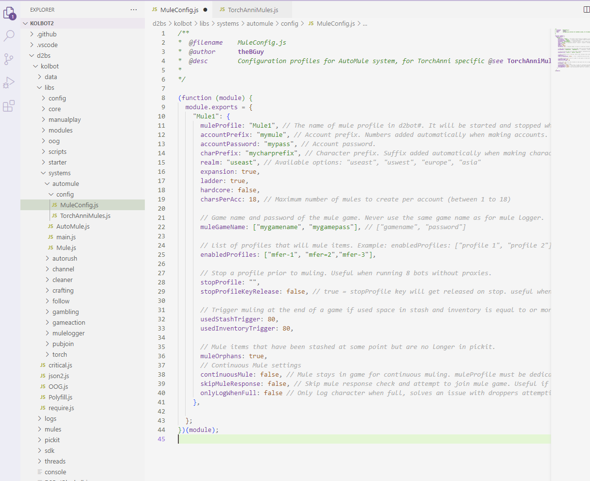
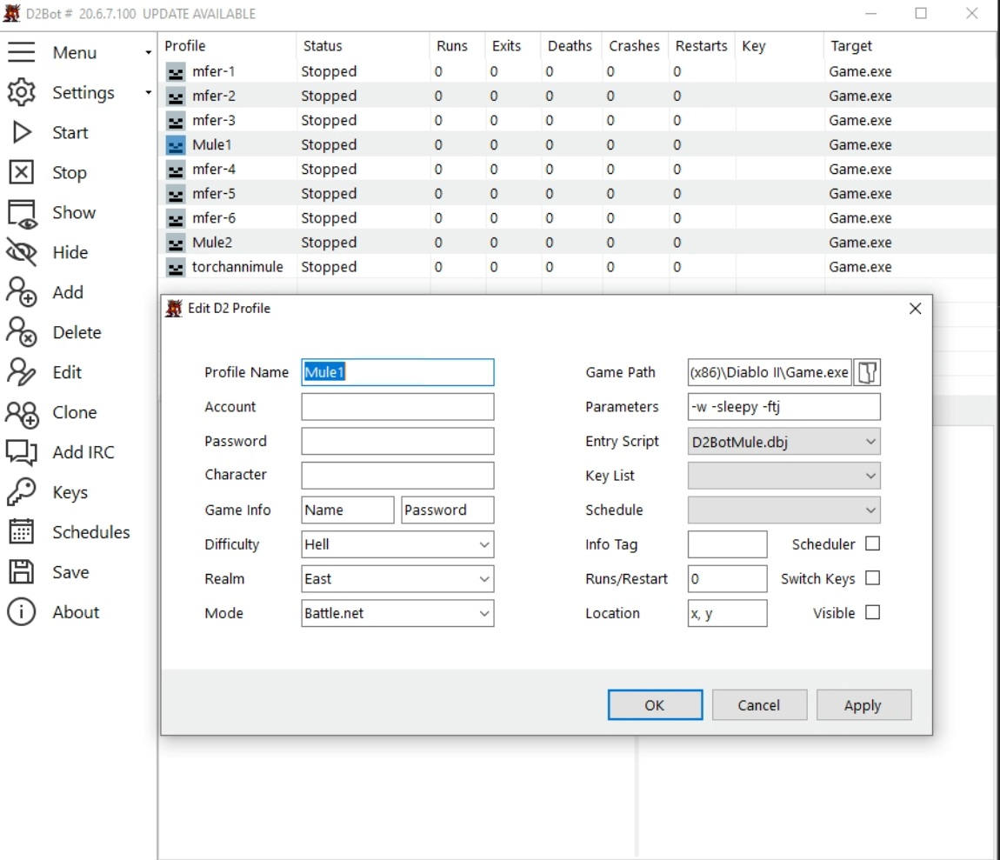
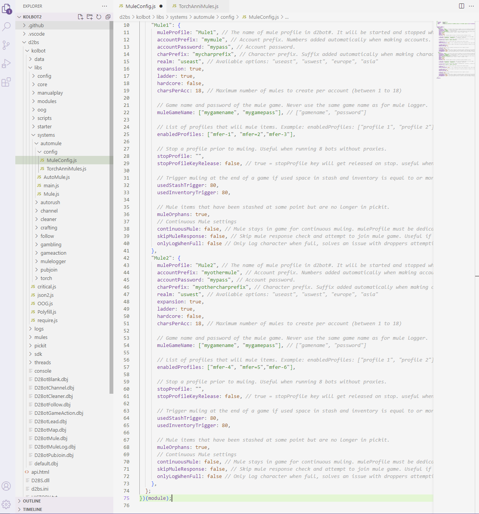
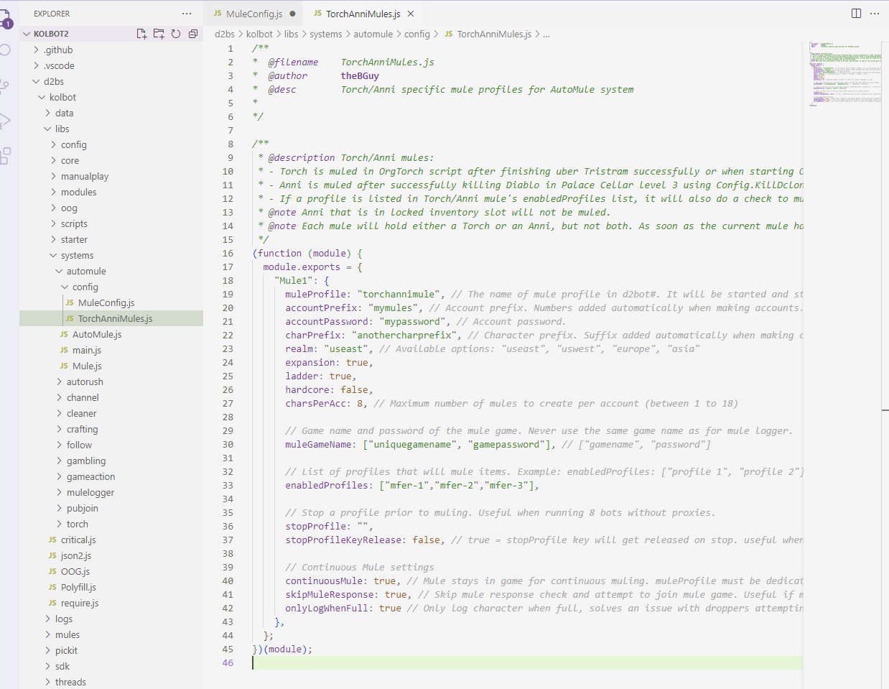

[D2Bot Table of Contents](https://bhdocs.github.io/docs/category/d2bot)

[Kolbot Table of Contents](https://bhdocs.github.io/docs/category/kolbot)

---

# Automule

---

* [Step-by-Step Guide to Muling in Kolbot](#step-by-step-guide-to-muling-in-kolbot)
* [Multiple Mules and Multiple Realm Muling](#multiple-mules-and-multiple-realm-muling)
* [Torch & Anni Muling](#torch-anni-muling)

---

## Step-by-Step Guide to Muling in Kolbot

1. Open and configure MuleConfig.js found in kolbot/libs/systems/automule/config folder
   **These are examples corresponding to the manger image below.  Your settings should be different.**

2. Open D2Bot# and click Add Profile icon

3. Input Profile Name, Diablo Path and use D2BotMule.dbj as Entry Script.  Profile Name should match muleProfile in MuleConfig.j

	Click OK. You're done.

## Multiple Mules and Multiple Realm Muling

The Mules object can take multiple sub-entries which are separated by a comma.

This makes it possible to use AutoMule on multiple realms or create custom muling rules (ie. which profile will use which mule).

Example config for muling on two realms: 

The names of each sub-entry must be different ("Mule1" and "Mule2" in the example).

Different sub-entries may use the the same mule profile.

## Torch Anni Muling

TorchAnniMule is used in conjunction with a profile running OrgTorch or CloneKilla script to exclusively mule Hellfire or Annihilius unique charms.

Open and configure TorchAnniMules.js found in kolbot/libs/systems/automule/config folder.  Configuration should be very similar to MuleConfig.

## Final Notes

You must have at least 2 CD Keys to use kolbot AutoMule.

It is not recommended to mix torch mule accounts with regular automule accounts. For best results use a separate profile.

If you are running multiple mules on the same realm make sure you set different game names, and account names.

Continuous mule will greatly reduce the times the mule logs in reducing the chance of realm down.

The mule profile is automatically started and stopped so you don't need to do that yourself.

You can test muling by running one of the enabledProfiles and pressing Numpad 5 when in a game or by right-clicking on a profile and select "mule profile".