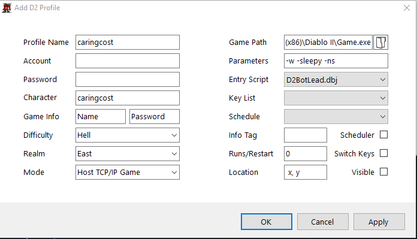
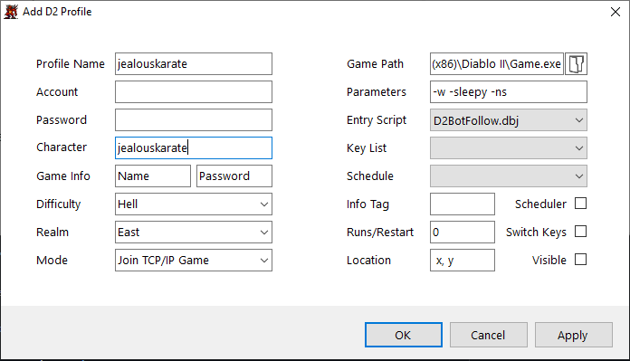

[D2Bot Table of Contents](https://bhdocs.github.io/category/d2bot)

[Kolbot Table of Contents](https://bhdocs.github.io/category/kolbot)

---

# TCP/IP games

---

* [Info](#info)
* [Host config](#host-config)
* [Join config](#join-config)

---

## Info

* [d2bs](https://github.com/blizzhackers/kolbot) allows botting in TCP/IP created games

## Host config

1. Create and edit a new profile in your D2Bot manager, set the mode to `Host TCP/IP Game`

## Join config

1. Create and edit a new profile in your D2Bot manager, set the mode to `Join TCP/IP Game`

