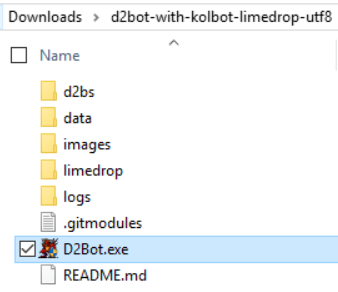
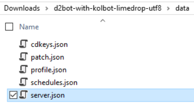
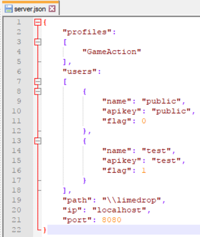
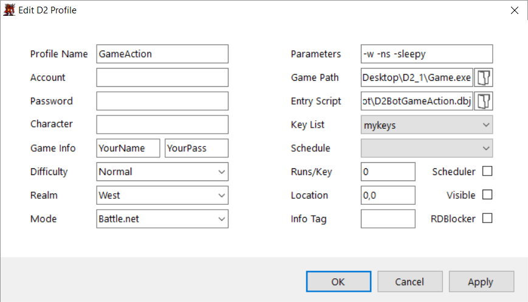

# Setup Limedrop
1. Download the Limedrop version from [here](https://github.com/blizzhackers/kolbot/archive/master.zip) or clone from: _https://github.com/blizzhackers/kolbot.git_

1. Extract to a folder:
	

1. Edit the server.json config file:
	* 
	* 
	* This default config says to:
		* Use the D2BS profile called "GameAction"
		* Create a user with the name "public", password "public" who **is not** able to drop items
		* Create a user with the name "test", password "test" who **is** able to drop items
		* The path to the web page files are in the "\limedrop" folder underneath the D2BS directory
		* The IP we will respond on is "localhost" (also known as 127.0.0.1)
			* If you want to access from another computer, you will need to use your real local IP like 192.168.1.100
        * The Port we will listen on is 8080
	
1. Turn on D2Bot and enable the Limedrop API by going to "Settings" and clicking the enable API option.

1. Follow the standard setup guide for adding cdkeys.

1. Create a new profile, we will use GameAction for an example - this needs to match what is in server.json
	* Make sure you set your own game name to avoid conflicts with other people
		* 
    * Make sure you use the D2BotGameAction.dbj as the Entry Script