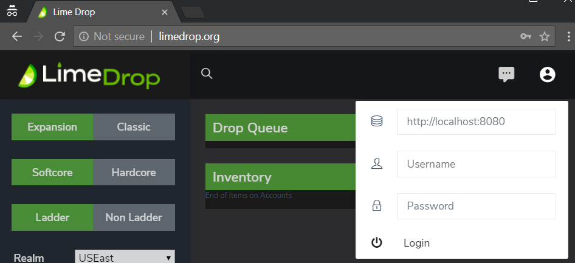
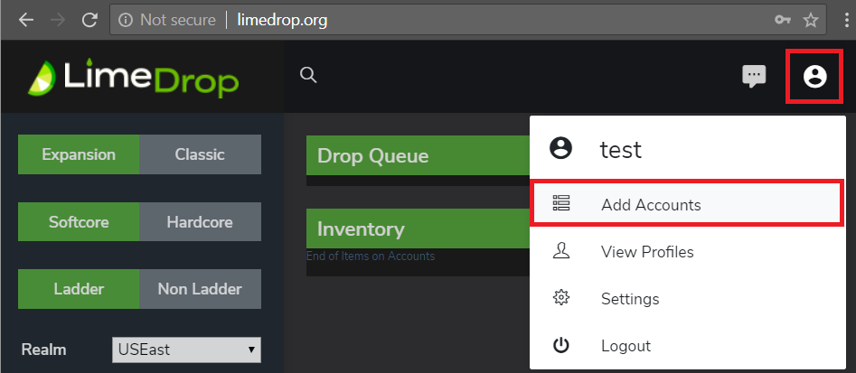
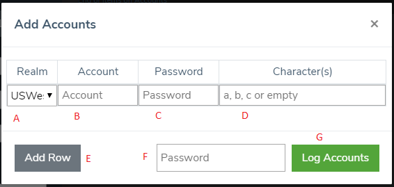

# Using Limedrop
To start Limedrop, just open D2BS.exe . You DO NOT have to launch the profile manually.
Limedrop will launch the profile on its own when it needs to do something.

## Logging In
* To login, either go to [http://www.limedrop.org](http://www.Limedrop.org) or your self-hosted page
* At the upper right, click the profile icon to log in:
	* 
	* Enter your server address (including port) according to your server config
	* Enter your username
	* Enter your password
	* **Click Login**
		* Right now you have to manually click Login. You cannot just press enter.

## Muling Options
* You can create a profile using the standard [MuleLogger profile](https://github.com/blizzhackers/documentation/blob/master/kolbot/D2BotMuleLog.md)
	* All mules logged this way will appear in the Limedrop web page

**The creation of games was removed from limedrop, so don't try to log mules/accounts with it**, because in some cases limedrop was creating a new game and it was dropping items, then left that game.

<!--* You can use the Web Interface to manually add a whole profile, or a single character:
	* 
	* 

	A - Select the realm for the account

	B - Diablo Account

	C - Diablo Account password

	D - Type specific character names, or leave it empty to log all

	E - Click "Add Row" if you want to add more than one account at a time

	F - Limedrop account password

	G - Click to begin logging accounts

**Notes:**

	* it is safe to log the same account by "adding" it through this interface. It will just update the files.

	* currently you _can not_ use Numpad 5 to manually log a character with Limedrop
-->
## Emergency Stop
You may notice that if you "stop" the GameAction profile that it immediately starts up again.

If you need to force the profile to stop you need to open the profile and erase the "tag" information. 

* Edit Profile
* Erase information in Tag
* Click Apply
* Stop the profile

**Note:** If you have queued many drops, you will need to clear it for each drop, or you will need to restart D2BSharp.